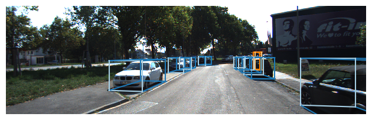
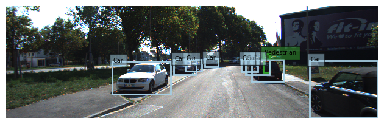

# Simple Kitti Scripts

This repository contains simple visualization scripts 
for [Kitti](http://www.cvlibs.net/datasets/kitti/) 
and [Semantic Kitti](http://www.semantic-kitti.org/) dataset.
 
## Setup
```
conda create -n kitti python=3.7
conda activate kitti
conda install numpy matplotlib mayavi scikit-image seaborn
conda install pyface=7.1.0
```


## Kitti

### draw_3dbox_in_cloud


### draw_3dbox_in_img


### draw_2dbox_in_img


### proj_cloud_to_img


### proj_img_to_cloud

(for better visualization, it is recommended to adjust the ```point size``` in mayavi pipeline setting)


## Semantic Kitti

### draw_label_in_cloud


## Reference

[simple_kitti_visualization](https://github.com/zzzxxxttt/simple_kitti_visualization)

